# Reporting Application

its an application is responsble for reportings issues that faced on the street to share them with other peaple and Agents to fix and share news with others of the area.

# Technologies

- Flutter to make Cross-platform application for all users ( ios - android )
- Bloc ( State Managment )
- Firebase Auth - Firebase Firestore - Firebase Firestorage

# Properties of Application

- Simple & Easy UI
- Registration and Login
- Add an issue
- Add news
- Searh for Category of an issue
- Share posts with others
- Interact with posts
- Chat with other users on the post
- Real-time chat and Interacts of posts 
- Search for post
- Filter posts
- Hide and Undo posts
- Settings
- Profile screen
- Activity Screen

# Screenshots

    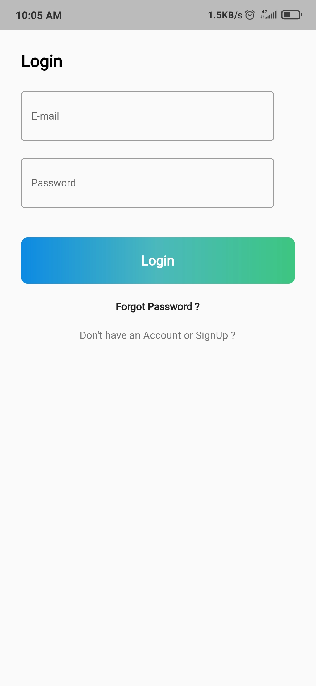    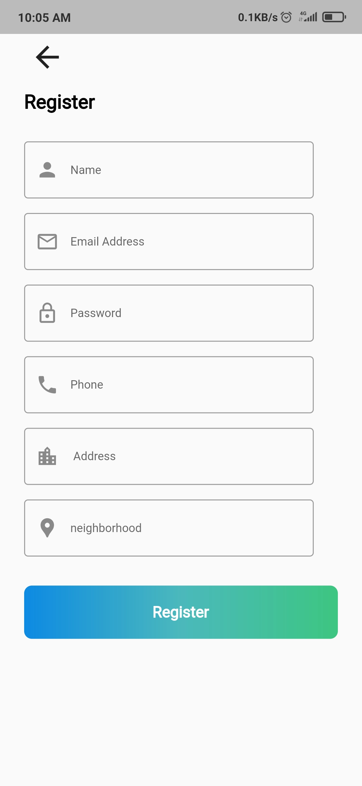 

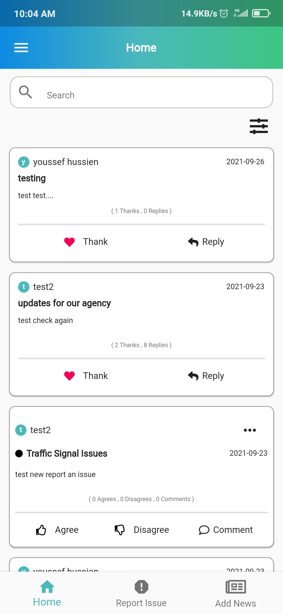    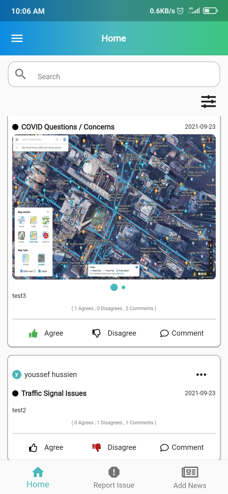    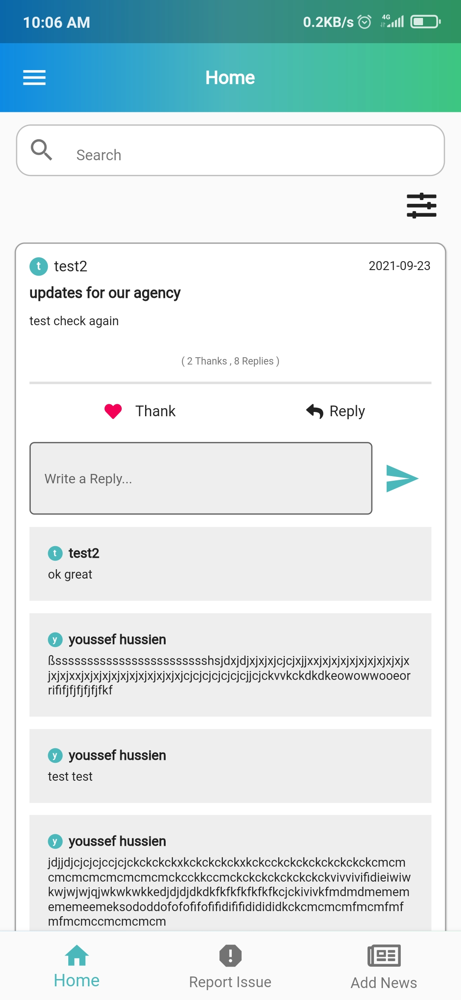

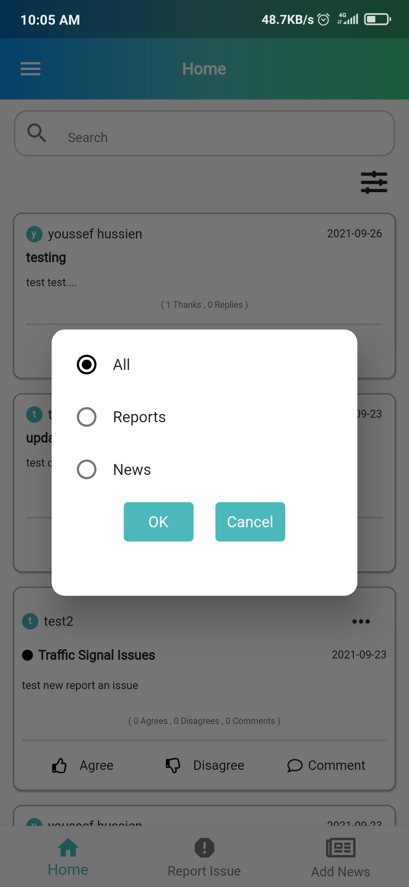    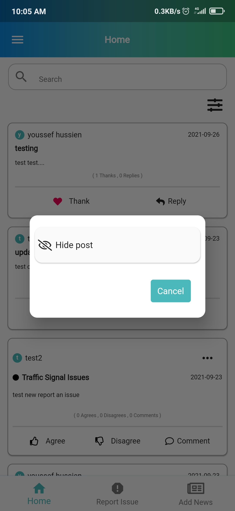    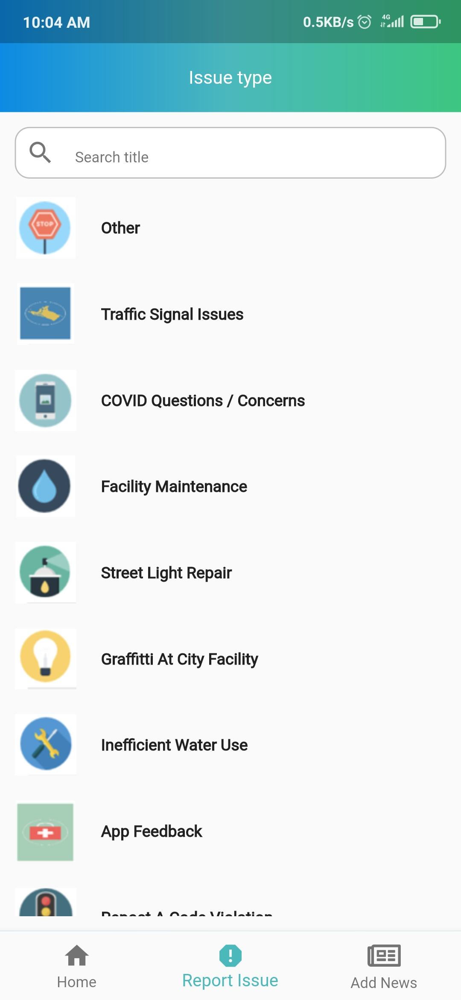

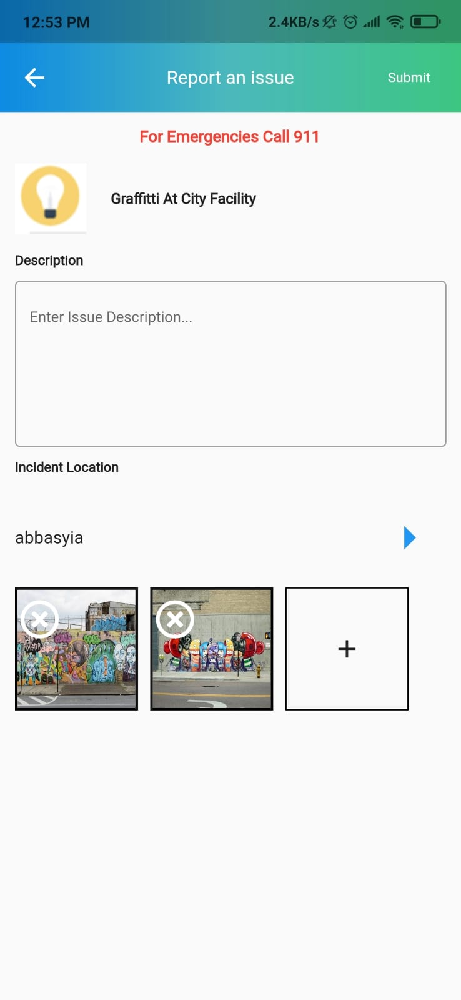    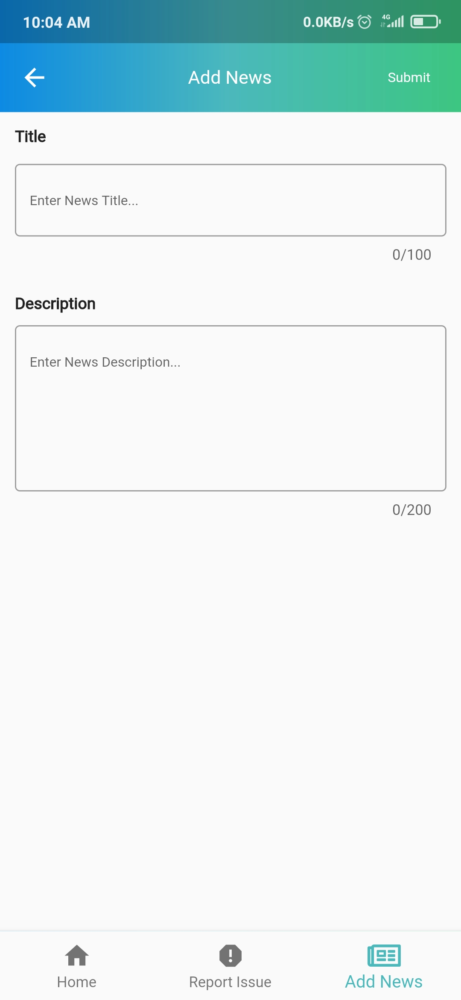    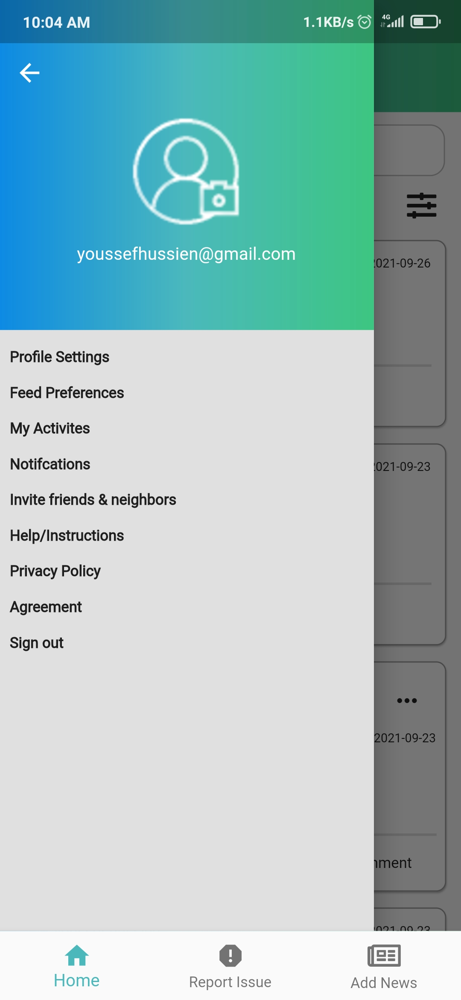

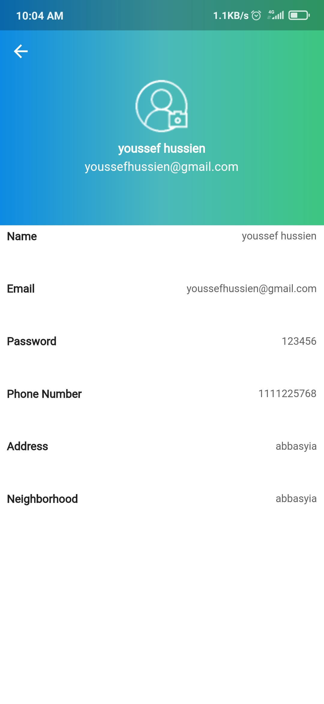    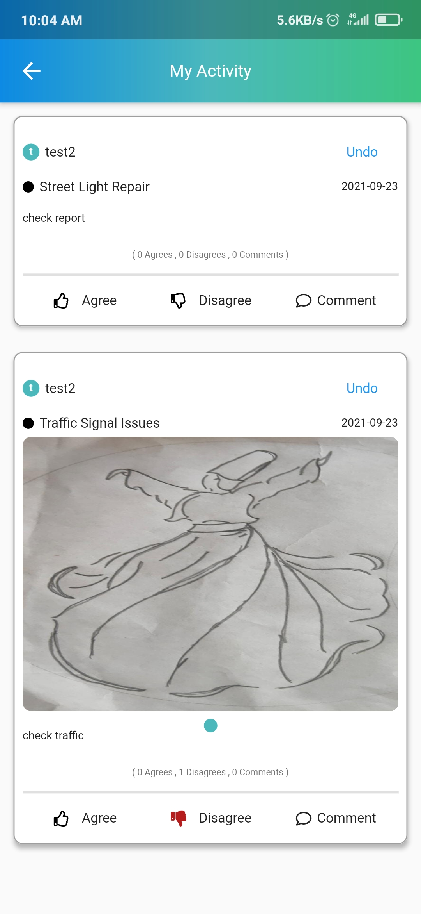

